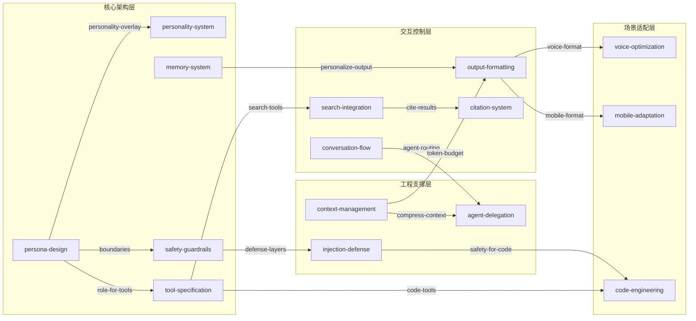

# 系统提示词设计模式库 — Skill Index

> 本库由 cangjie-skill 方法论蒸馏而成，语料来源为 system_prompts_leaks/（165 个系统提示词）。
> 覆盖厂商: Anthropic, Google, OpenAI, xAI, Perplexity, Meta, Mistral, Notion, Warp, Brave 等
> 共产出 **15** 个 skills。
> 蒸馏时间: 2026-05-04

## 关于本库

- **语料来源**: 165 个泄露的系统提示词
- **覆盖产品**: Chat 应用、编程 Agent、浏览器 Agent、文档编辑、语音助手、AI 搜索、教育平台、企业 Workspace、设计工具
- **一句话主旨**: 从顶级 AI 产品中蒸馏出的 15 个可复用系统提示词设计模式
- **整库理解**: 见 [OVERVIEW.md](./OVERVIEW.md)

---

## Skill 列表 (按功能分组)

### 核心架构层

- [`persona-design`](./persona-design/SKILL.md) — 身份与人格定义模式：角色声明 + 能力边界 + 行为修饰符 + 关系框架
- [`personality-system`](./personality-system/SKILL.md) — 可插拔人格系统设计：基础人格 + 人格叠加层 + 共享元规则
- [`tool-specification`](./tool-specification/SKILL.md) — 工具定义与集成模式：定义格式 + 权限门控 + 发现机制 + 生命周期管理
- [`safety-guardrails`](./safety-guardrails/SKILL.md) — 安全防线与伦理边界设计：多层纵深防御 + 权限分级 + 级联锁定
- [`memory-system`](./memory-system/SKILL.md) — 记忆与个性化架构：CRUL 生命周期 + 类型化记忆 + 静默应用 + 边界控制

### 交互控制层

- [`output-formatting`](./output-formatting/SKILL.md) — 输出格式与风格控制：自适应长度 + 反陈词滥调 + 平台特定格式
- [`conversation-flow`](./conversation-flow/SKILL.md) — 对话流程与路由设计：意图分类 + 澄清策略 + 自主级别 + 工作流生命周期
- [`search-integration`](./search-integration/SKILL.md) — 搜索与知识检索集成：搜索优先策略 + 多查询组合 + 源优先级层次
- [`citation-system`](./citation-system/SKILL.md) — 引用与归属系统设计：内联引用格式 + 强制引用规则 + 来源可审计性

### 工程支撑层

- [`context-management`](./context-management/SKILL.md) — 上下文与窗口管理：Token 预算感知 + 分层压缩 + 延迟加载 + 缓存感知调度
- [`agent-delegation`](./agent-delegation/SKILL.md) — 多代理与委派模式：子代理专业化 + 上下文隔离 + 输出通道分离
- [`injection-defense`](./injection-defense/SKILL.md) — 注入防御与安全架构：多层防御链 + 规则不可变性 + 内容信任分级 + 反泄露元规则

### 场景适配层

- [`voice-optimization`](./voice-optimization/SKILL.md) — 语音场景优化：简洁优先 + 口语转换 + 格式降级 + 音频安全约束
- [`mobile-adaptation`](./mobile-adaptation/SKILL.md) — 移动端适配：屏幕尺寸响应层级 + 原生工具集成 + 格式限制
- [`code-engineering`](./code-engineering/SKILL.md) — 编程代理模式：安全优先 Git 工作流 + 计划生命周期 + 验证循环

---

## 引用图

图例:
- `-->`  depends-on / enables
- `-.->` contrasts-with
- `===>` composes-with

---

## 快速组合指南

### 构建 Chat 应用
persona-design + personality-system + output-formatting + safety-guardrails + memory-system

### 构建 AI Agent
persona-design + tool-specification + conversation-flow + agent-delegation + injection-defense

### 构建 AI 搜索
persona-design + search-integration + citation-system + output-formatting + context-management

### 构建编程 Agent
persona-design + code-engineering + tool-specification + agent-delegation + injection-defense

### 构建语音助手
persona-design + voice-optimization + search-integration + output-formatting + safety-guardrails

### 构建企业 Workspace 助手
persona-design + memory-system + search-integration + conversation-flow + output-formatting + safety-guardrails

---

## 推荐学习顺序

1. **persona-design** — 最基础，所有系统提示词的起点
2. **safety-guardrails** — 第二优先，安全是底线
3. **output-formatting** — 最直观的效果提升
4. **tool-specification** — 从 Chat 到 Agent 的关键桥梁
5. **conversation-flow** — 控制多轮对话的引擎
6. **search-integration** — 知识增强的核心
7. **memory-system** — 长期个性化的基础
8. **context-management** — 工程优化的关键
9. **personality-system** — 差异化体验的利器
10. **citation-system** — 信任与可审计性
11. **injection-defense** — 安全深度加固
12. **agent-delegation** — 复杂任务编排
13. **voice-optimization** — 语音场景专项
14. **mobile-adaptation** — 移动端专项
15. **code-engineering** — 编程场景专项

---

## 接入 darwin-skill

所有 skill 均可接入 darwin-skill 进行自动进化。

---

## 审计轨迹

- 整库理解: [OVERVIEW.md](./OVERVIEW.md)
- 候选单元池: [candidates/](./candidates/)
- 被淘汰的候选: [rejected/](./rejected/)
